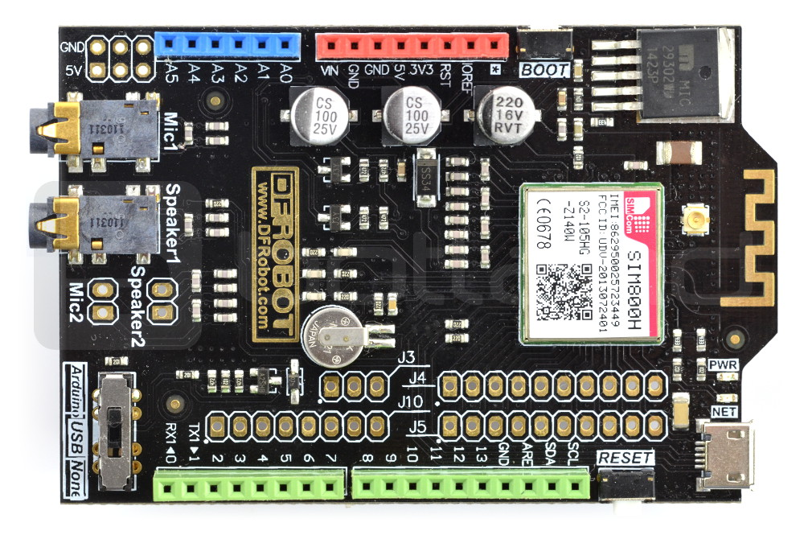

# ISPGSMProjekt - Inteligentne Systemy Pomiarowe - Projekt 5

## English description
Project for integrating Arduino board with a SIM800H module with SmartStorm platform using GPRS technology. Arduino Leonardo is used as platform, and Arduino GPRS Shield with SIM800H module is used for communication. The application sends data read from ultrasonic sensor (substituted by random integer) to sensor registered on the Smartstorm platform and specified in code by user.

## Cel projektu
Stworzyć aplikację pomiarową pozwalającą na komunikację z wykorzystaniem modułu GSM/GPRS. Projekt dotyczy zbudowania urządzenia umożliwiającego zbieranie danych na temat wykrytego ruchu przez czujniki pomiarowe wraz z wysyłaniem informacji do zdefiniowanych odbiorców i umieszczaniem wpisów na serwerze w chmurze.

## General Packet Radio Service
GPRS jest technologią bezprzewodowego przesyłu danych stosowaną w sieciach telefonii komórkowej, wykorzystującą istniejącą już infrastrukturę techniczną sieci GSM. Transmisja informacji odbywa się w oparciu o podział danych na pakiety, w których zakodowane mogą być wiadomości tekstowe, dźwięki i obraz.
Zalety GPRS:
- maksymalna przepustowość połączenia wynosi około 80 kbps,
- użytkownik płaci za ilość przesyłanych danych, a nie za czas trwania połączenia,
- użytkownik korzystający z łączności sieciowej nie zajmuje przez cały czas połączenia danego pasma, co pozwala operatorom na większą elastyczność.

## Sprzęt
W ramach projektu wykorzystano poniższe elementy do konstrukcji urządzenia.

### Arduino Leonardo

Układ z rodziny Arduino oparty o procesor ATmega32U4 z wbudowaną obsługą USB.

### DFRobot Shield GPRS SIM800H

Przystawka do Arduino, zawierająca moduł GSM SIM800H, pozwalająca na komunikację przez sieć komórkową. Do poprawnego działania wymaga podłączenia zasilania 6-12 V.

## Środowisko programistyczne i język

Wykorzystanie modułów Arduino w projekcie wymusiło wykorzystanie do programowania środowiska Arduino IDE. Do tworzenia oprogramowania wykorzystano dedykowany język Arduino, który jest prostym w użyciu narzędziem, gdyż opiera się na dobrze znanych programistom C oraz C++. Samo środowisko Arduino IDE pozwala nie tylko na kompilowanie szkiców, ale też bezpośrednie wgrywanie ich na płytkę docelową oraz monitoring portu szeregowego, co jest pomocne przy debugowaniu.

## Komunikacja z modułem GSM - komendy AT
Znane są też jako komendy Hayesa, od nazwy pierwszej firmy, która je zastosowała w swoich produktach. Jest to zbiór standardowych komend, służących do wydawania poleceń modułowi GSM lub do konfiguracji modemu.
Każda komenda zaczyna się od znaków "AT" i kończy znakiem powrotu karetki oraz nowej linii. W projekcie polecenia te przesyłane są do modułu SIM800H poprzez interfejs UART, zrealizowany w Arduino Leonardo sprzętowo na pinach 0 i 1.
Przykładowe użycie komend AT do wysłania wiadomości SMS:

	AT+CMGF=1\r\n
	AT+CMGS=„111222333”\r\n";
	WIADOMOSC
	^Z

Wiadomości SMS są zawsze zakończone znakiem CRTL+Z jako terminatorem.

## Uruchomienie
By uruchomić zestaw należy najpierw połączyć płytkę Arduino Leonardo z DFRobot Shield GPRS SIM800H, podłączyć zasilanie oraz skompilować szkic ISPGPRS.ino. Nie jest konieczne wykorzystanie jakichkolwiek zewnętrznych bibliotek. Następnie należy podłączyć Arduino Leonardo przez port usb do komputera i przesłać skompilowany kod na płytkę.
